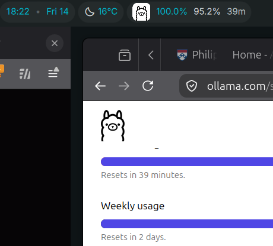

# Dank Ollama Usage — DankMaterialShell bar widget

A single-config DankBar widget that shows the Ollama icon, then your
**session** and **weekly** usage percentages. It polls:

```
curl -H "Authorization: $OLLAMA_API_KEY" https://ollama.com/api/usage
```

and renders `limits.session.usage` and `limits.weekly.usage` as percentages
(usage values are fractions of 1.0, so `0.079` → `7.9%`).

## Files
- `plugin.json` — DMS widget manifest
- `OllamaUsageWidget.qml` — bar pill (horizontal + vertical)
- `OllamaUsageSettings.qml` — settings UI
- `ollama.svg` — local llama glyph (fallback; not currently used)

## Single config value
`OLLAMA_API_KEY` — the Authorization header value sent to the API. Set it in
the plugin's settings panel (DMS Settings → Plugins → Dank Ollama Usage).
Optional `updateInterval` (seconds, default 300).

## Icon
The bar icon loads a remote PNG from `https://ollama.com/public/ollama.png` in
`OllamaUsageWidget.qml` (`Image.source`). It needs network access (the `network`
permission) and will be blank until it loads. `ollama.svg` is kept as a local
fallback — to use it, swap `source:` back to `"ollama.svg"`. Note a trailing
comma after the `source:` value will break QML compile (`Expected token ','`).

## Install
1. Copy this directory into DMS's plugin dir (e.g. `~/.config/DankMaterialShell/plugins/dank-ollama-usage/`)
```
mkdir -p ~/.config/DankMaterialShell/plugins/dank-ollama-usage/
cp * ~/.config/DankMaterialShell/plugins/dank-ollama-usage/
journalctl --user -fu dms.service
```
2. In DMS Settings → Plugins, **Scan for Plugins**, toggle it on
3. Add the pill to your DankBar layout
4. Set `OLLAMA_API_KEY` in its settings

## From the commandline, you can do the following:

see more info in https://danklinux.com/docs/dankmaterialshell/plugin-development

```
sven@x1yoga:~/src/claude-test/dank-bar$ dms ipc call plugins list
dankOllamaUsage [disabled]
sven@x1yoga:~/src/claude-test/dank-bar$ dms ipc call plugins reload dankOllamaUsage
PLUGIN_RELOAD_FAILED: dankOllamaUsage
```

## Reloading after editing QML

The Quickshell runtime (`qs`) caches the compiled QML component **in memory** and
does **not** invalidate it when you edit the file. `dms ipc call plugins reload`
can also fail because of an unrelated DMS registry issue (see below). After
fixing a compile error, the reliable way to force a fresh load is to restart the
whole shell service:

```
systemctl --user restart dms.service
```

Then watch it come up without a QML component error:

```
journalctl --user -fu dms.service
# expect: DankBar: Plugin loaded: dankOllamaUsage
```

If you see `Non-existent attached object` at some line, the QML uses an attached
property (`Foo.text`) of a type (`Foo`) that isn't a known type in this
Quickshell/DMS environment — e.g. `ToolTip.text` isn't supported here. Remove it
(or use a custom `MouseArea`/popup instead).

Note: `dms ipc call plugins reload` can return `PLUGIN_RELOAD_FAILED` because
DMS's own registry clone fails with `failed to re-clone registry: permission
denied` on `/tmp/dankdots-plugin-registry/.git/objects/pack/*` (pack files end
up `-r--r--r--`, owned by the user). That's unrelated to your plugin and blocks
plugin *listing* via IPC — a full `systemctl --user restart dms.service` still
loads plugins fine.

## Screenshot



## Sample output (from the API)
Given `{"limits":{"session":{"usage":0},"weekly":{"usage":0.079}}}`:
`🦙 0.0%  7.9%`

# development docs:

https://danklinux.com/docs/dankmaterialshell/plugin-development
