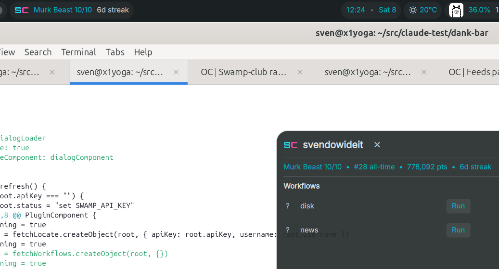

# dank-bar

DankMaterialShell bar widgets.

yes, these are quick "what would happen if" DeepSeek v4 flash built plugins that go with things i'm playing with



## Widgets

### [Dank Ollama Usage](OllamaUsageWidget/)

Shows your Ollama session and weekly usage percentages.


### [Dank Swamp Club](SwampClubWidget/)

Shows your Swamp Club tier, rank, and streak.


## Install

Copy a widget directory into DMS's plugin dir, then scan and enable it:

```
mkdir -p ~/.config/DankMaterialShell/plugins/
cp -r OllamaUsageWidget ~/.config/DankMaterialShell/plugins/
cp -r SwampClubWidget ~/.config/DankMaterialShell/plugins/
systemctl --user restart dms.service
```

Then in DMS Settings → Plugins, **Scan for Plugins**, toggle the widget on, and add it to your bar layout.
