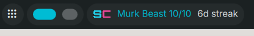

# Dank Swamp Club — DankMaterialShell bar widget

A DankBar widget that shows the Swamp Club logo, your **tier** (e.g. Murk Beast 10/10),
and your **streak** (e.g. 6d streak). It polls two API endpoints:

```
curl -H "Authorization: Bearer $SWAMP_API_KEY" https://swamp-club.com/api/v1/u/{username}/card
curl -H "Authorization: Bearer $SWAMP_API_KEY" https://swamp-club.com/api/v1/leaderboard/locate?q={username}
```

The card endpoint provides `tierName`, `ordinal`, `tier`, and `score`. The locate
endpoint provides `streak` and `alltimeRank` from the streaks and alltime boards.

## Files
- `plugin.json` — DMS widget manifest
- `SwampClubWidget.qml` — bar pill (horizontal + vertical)
- `SwampClubSettings.qml` — settings UI

## Config values
- `SWAMP_API_KEY` — your Swamp Club API key (`swamp_...`). Create one at
  swamp-club.com → Settings → Access Tokens.
- `username` — your Swamp Club username (e.g. `svendowideit`)
- `updateInterval` — poll interval in seconds (default 300)

## Icon
The bar icon loads the Swamp Club favicon SVG from `https://swamp-club.com/favicon.svg`.
It needs the `network` permission and will be blank until it loads.

## Install
1. Copy this directory into DMS's plugin dir:
```
mkdir -p ~/.config/DankMaterialShell/plugins/dank-swamp-club/
cp * ~/.config/DankMaterialShell/plugins/dank-swamp-club/
```
2. In DMS Settings → Plugins, **Scan for Plugins**, toggle it on
3. Add the pill to your DankBar layout
4. Set `SWAMP_API_KEY` and `username` in its settings

## Reloading after editing QML
```
systemctl --user restart dms.service
journalctl --user -fu dms.service
# expect: DankBar: Plugin loaded: dankSwampClub
```

## Screenshot



## Sample output
Given a profile with tier "Murk Beast", ordinal 10, and a 6-day streak:
`[SC] Murk Beast 10/10  6d streak`

Hover for a tooltip with all-time rank, score, and streak details.
